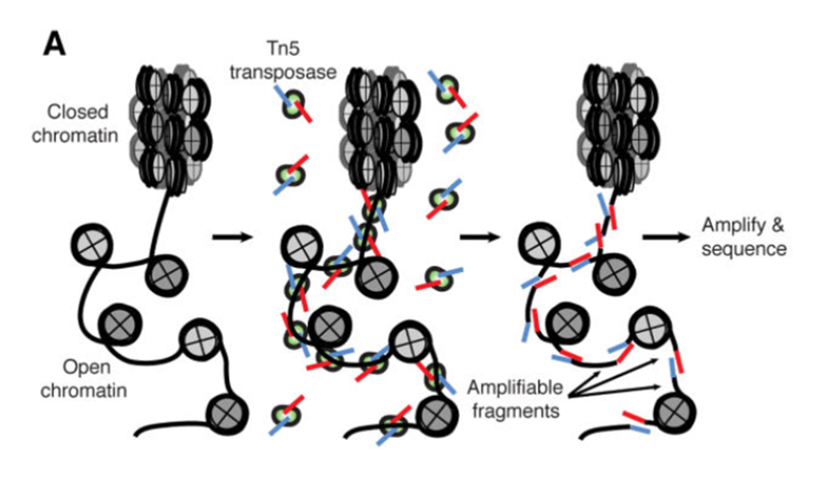
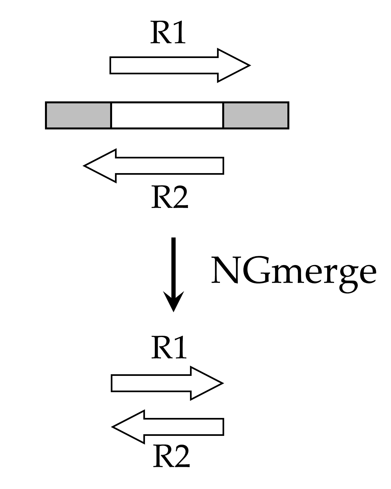
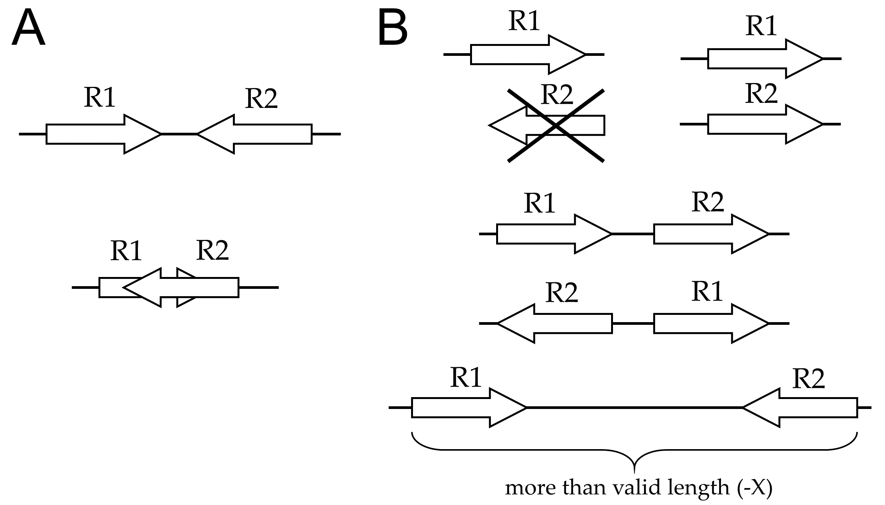

Title: ATAC-seq Guidelines
Date: 2017-10-01
Category: Tutorials
Author: John M. Gaspar
Tags: ATAC-seq
Summary: This tutorial provides a workflow notes and recommendations for ATAC-seq analysis.


## ATAC-seq Overview

ATAC-seq (Assay for Transposase-Accessible Chromatin with high-throughput sequencing) is a method for determining chromatin accessibility across the genome.  It utilizes a hyperactive Tn5 transposase to insert sequencing adapters into open chromatin regions (Fig. 1).  High-throughput sequencing then yields reads that indicate these regions of increased accessibility.



Figure 1.  ATAC-seq overview ([Buenrostro *et al.*, 2015](https://www.ncbi.nlm.nih.gov/pmc/articles/PMC4374986/)).


## Experimental design

The developers of the ATAC-seq method have published a [detailed protocol](https://www.ncbi.nlm.nih.gov/pmc/articles/PMC4374986/) for the laboratory procedure (Buenrostro *et al.*, 2015).

Here are a few additional things to consider when planning an ATAC-seq experiment:

### 1 Replicates

Like most high-throughput sequencing applications, ATAC-seq requires that biological replicates be run.  This ensures that any signals observed are due to biological effects and not idiosyncracies of one particular sample or its processing.  To begin with, two replicates per experimental group are sufficient.

### 2 Controls

With ATAC-seq, control groups are not typically run, presumably due to the expense and the limited value obtained.  A control for a given sample would be genomic DNA from the sample that, instead of transposase treatment, is fragmented (e.g. by sonication), has adapters ligated, and is sequenced along with the ATAC sample.  Such a control could be useful to help define regions of the genome that are more challenging to sequence or to align reads unambiguously.

### 3 PCR amplification

In preparing libraries for sequencing, the samples should be amplified using as few PCR cycles as possible.  This will help to reduce PCR duplicates, which are exact copies of DNA fragments that can interfere with the biological signal of interest.

### 4 Sequencing depth

Sequencing depth will vary based on the size of the reference genome and the degree of open chromatin expected.  For studies of human samples, [Buenrostro *et al.* (2015)](https://www.ncbi.nlm.nih.gov/pmc/articles/PMC4374986/) recommend more than 50 million mapped reads per sample.
[Another important consideration is that a large proportion of reads from an ATAC-seq run typically are derived from the mitochondrial genome (see below for more details).]

### 5 Sequencing mode

For ATAC-seq, we recommend **paired-end sequencing**, for several reasons.

* More sequence data leads to better alignment results.  Many genomes contain numerous repetitive elements, and failing to align reads to certain genomic regions unambiguously renders those regions inaccessible to the assay.  Additional sequence data, such as with paired-end sequencing, helps to reduce these alignment ambiguities.

* With ATAC-seq, we are interested in knowing the full span of the DNA fragments generated by the assay.  A DNA fragment generated by the ATAC is typically longer than a sequence read, so a read will define only one end of the fragment.  Therefore, with single-end sequencing, we would have to guess where the other end of the fragment is.  Since paired-end sequencing generates reads from both ends, the full span of the DNA fragment is known precisely.

* PCR duplicates are identified more accurately.  As noted above, PCR duplicates are artifacts of the procedure, and they should be removed as part of the analysis pipeline (see below for more details).  However, computational programs that remove PCR duplicates (e.g. Picard’s [MarkDuplicates](http://broadinstitute.github.io/picard/command-line-overview.html#MarkDuplicates)) typically identify duplicates based on comparing ends of aligned reads.  With single-end reads, there is only one position to compare, and so any reads whose 5’ ends match will be considered duplicates.  Thus, many false positives may result, and perfectly good reads will be removed from further analysis.  On the other hand, after paired-end sequencing, both ends of the original DNA fragments are defined.  To be declared a duplicate, both ends of one fragment would need to match both ends of another fragment.  This is far less likely to occur by chance, so fewer false positives would occur.


## Compute access / Odyssey

This workflow assumes that you have an account on the [Odyssey computer cluster](https://www.rc.fas.harvard.edu/training/introduction-to-odyssey-online/), which can be requested [here](https://portal.rc.fas.harvard.edu/request/account/new).

Programs, like those listed below (e.g. FastQC, Bowtie2, MACS2), are run on Odyssey by submitting jobs via the [SLURM management system](https://www.rc.fas.harvard.edu/resources/running-jobs/).
The jobs take the form of shell scripts, which are submitted with the [sbatch command](https://www.rc.fas.harvard.edu/resources/running-jobs/#Submitting_batch_jobs_using_the_sbatch_command).


## Sequence reads

The raw sequence files generated by the sequencing core are in [FASTQ format](https://en.wikipedia.org/wiki/FASTQ_format).  They are gzip-compressed, with ‘.gz’ file extensions.  It is unnecessary, not to mention wasteful of time and disk space, to decompress the sequence files; all common bioinformatics tools can analyze compressed files.

For paired-end sequencing, there are two files per sample: <sample>.R1.fastq.gz and <sample>.R2.fastq.gz.

Samples that were sequenced on multiple lanes may have separate files for each lane; these should be concatenated using the `cat` command:

    cat <sample>.lane1.R1.fastq.gz <sample>.lane2.R1.fastq.gz > <sample>.R1.fastq.gz
    cat <sample>.lane1.R2.fastq.gz <sample>.lane2.R2.fastq.gz > <sample>.R2.fastq.gz

However, different replicates should not be concatenated, but instead should be processed separately.


## Quality control

### FastQC

It is generally a good idea to generate some quality metrics for your raw sequence data.  One tool that is commonly used for this purpose is [FastQC](https://www.bioinformatics.babraham.ac.uk/projects/fastqc/).

On Odyssey, each sequence file would be analyzed like this:

    module load fastqc
    fastqc <sample>.R1.fastq.gz


The output from FastQC is an HTML file, which can be examined via a web browser.  The report lists various statistics about your reads, such as their count and lengths.  It also provides graphical representations of your data based on a number of categories, including quality scores, GC levels, PCR duplicates, and adapter content.

The FastQC report is there to alert you to potential issues with your data, but it is not the final determinant of the outcome of your ATAC-seq experiment.  Do not be overly concerned if your FastQC reports contain one or more red ‘X’ marks; this is not a reason to delete your data and start all over again.


### Adapter removal

For reads derived from short DNA fragments, the 3’ ends may contain portions of the Illumina sequencing adapter.  This adapter contamination may prevent the reads from aligning to the reference genome and adversely affect the downstream analysis.  If you suspect that your reads may be contaminated with adapters (either from the FastQC report [“Overrepresented sequences” or “Adapter content” sections], or from the size distribution of your sequencing libraries), you should run an adapter removal tool.  Here are two options:

#### 1 Cutadapt

One of the most widely used adapter removal programs is [cutadapt](http://cutadapt.readthedocs.io/en/stable/guide.html).
Cutadapt searches input reads for a given adapter sequence.  When it finds the adapter, it removes the adapter and everything that follows it.  Reads that do not match the adapter remain unaltered.

Some things to note when using cutadapt:
- The adapter sequences need to be provided via the `-a` argument.  If you do not know which adapters were used for your samples, consult the sequencing core.
- Cutadapt will attempt to match a minimal length of the provided adapter sequence.  The default value for this argument (`-O`) is 3bp.  The downside of using such a small value is the possibility of false positives (trimming reads’ good sequences that happen to match part of the adapter).  On the other hand, increasing this parameter will result in more false negatives, since reads with adapter contamination may contain sequencing errors that prevent a match.

#### 2 NGmerge

An alternative approach to adapter removal is provided by NGmerge, which was developed in the Informatics Group.  Unlike cutadapt, NGmerge does not require that the adapter sequences be provided, nor does it require a minimum length parameter.  However, it works only with paired-end sequencing, so those with single-end sequencing should stick with cutadapt.

NGmerge is based on the principle that, with paired-end sequencing, adapter contamination occurs only when both reads fully overlap.  The program tests each pair of reads for overlap, and in cases where they do, it clips the 3’ overhangs of both reads (Fig. 2).  Reads that do not overlap remain unaltered.



Figure 2.  The original DNA fragment contains sequencing adapters on both ends (gray boxes).  Because the fragment is short, the paired-end reads (R1, R2) extend into the sequencing adapters.  NGmerge aligns the reads, and clips the 3’ overhangs.


NGmerge is available on Odyssey:

    /n/informatics_external/temp/stitch/stitch --help

Of the many arguments available, here are the most important ones for this application:

| Argument   | Description                                  |
|------------|----------------------------------------------|
| `-a`       | adapter-removal mode (**must** be specified) |
| `-e <int>` | minimum length of overlap, i.e. the minimum DNA fragment length (default 50bp) |
| `-n <int>` | number of cores on which to run              |
| `-v`       | verbose mode                                 |


## Alignment

The next step is to align the reads to a reference genome.  There are many programs available to perform the alignment.  Two of the most popular are [BWA](http://bio-bwa.sourceforge.net/bwa.shtml) and [Bowtie2](http://bowtie-bio.sourceforge.net/bowtie2/manual.shtml).  We will focus on Bowtie2 here.

### Genome indexing

In order to align reads to a genome, the reference sequence must be indexed.  This is a time- and memory-intense procedure, but it needs to be done only once for a given genome.

For many model organisms, the genome and pre-built reference indexes are available from [iGenomes](https://support.illumina.com/sequencing/sequencing_software/igenome.html).  Otherwise, Bowtie2 indexes are made from a FASTA genome file using the program `bowtie2-build`:

    bowtie2-build <genome.fa> <genomeIndexName>


### Alignment

Once the indexes are built, the reads can be aligned using Bowtie2.  A brief look at the [manual](http://bowtie-bio.sourceforge.net/bowtie2/manual.shtml) reveals the large number of parameters and options available with Bowtie2.  Here are a few that may benefit alignment of an ATAC-seq dataset on Odyssey:

| Argument           | Description                                  |
|--------------------|----------------------------------------------|
| `-X <int>`         | maximum DNA fragment length (default 500bp).  If you anticipate that you may have DNA fragments longer than the default value, you should increase this parameter accordingly. |
| `--very-sensitive` | Bowtie2 has a number of alignment and effort parameters that interact in complex (and sometimes unexpected) ways.  Preset collections of these parameters are provided for convenience; the default is `--sensitive`, but better alignment results are frequently achieved with `--very-sensitive`. |
| `-p <int>`         | number of cores on which to run              |


The output is a [SAM file](https://samtools.github.io/hts-specs/SAMv1.pdf), which contains various alignment information for each input read.  The SAM can be compressed to a binary format (BAM) with [SAMtools](http://www.htslib.org/doc/samtools.html).  This is best accomplished by piping the output from Bowtie2 directly to `samtools view`, e.g.:

    bowtie2 <args> | samtools view -b - > <BAM>

Bowtie2 also provides (via stderr) a summary of the mapping results, including counts of reads analyzed, properly paired alignments, and reads that aligned to multiple genomic locations.  By default, Bowtie2 will randomly assign one of multiple equivalent mapping locations for a read.


### Alignment adjustments

#### Mitochondrial reads

It is a well-known problem that ATAC-seq datasets usually contain a large percentage of reads that is derived from mitochondrial DNA (for example, see [this discussion](http://seqanswers.com/forums/showthread.php?t=35318)).  Some have gone as far as [using CRISPR to reduce mitochondrial contamination](https://www.nature.com/articles/s41598-017-02547-w).

Assuming you have not gone the CRISPR route, you will have some mitochondrial reads in your sequence data.  We recommend that these reads be removed from the alignment file; since we are not interested in ATAC-seq peaks in mitochondrial genome, they will only complicate the subsequent steps.  There are two methods to deal with this.

1) Remove the mitochondrial genome from the reference genome before aligning the reads.  In human/mouse genome builds, the mitochondrial genome is labeled ‘chrM’.  That sequence can be deleted from the reference prior to building the genome index.  This is the cleanest approach, since ‘chrM’ will never enter the analysis. The downside is that the alignment numbers will look much worse; all of the mitochondrially-derived reads will count as unaligned.

2) Remove the mitochondrial reads after alignment.  (The issue here is that it’s not as simple as a one-line awk.  The bitwise FLAG of the SAM needs to be corrected for “not properly paired” alignments that include chrM.  Maybe filtering with -f 0x2 would do the trick, but really shouldn’t require this.)


#### PCR duplicates

PCR duplicates are exact copies of DNA fragments that arise during PCR.  Since they are artifacts of the library preparation procedure, they may interfere with the biological signal of interest.  Therefore, they should be removed as part of the analysis pipeline.

One commonly used program for removing PCR duplicates is Picard’s [MarkDuplicates](http://broadinstitute.github.io/picard/command-line-overview.html#MarkDuplicates)).  For convenience, we instead recommend removing duplicates with [MACS2](https://github.com/taoliu/MACS) as part of the next peak-calling step.


## Peak calling

Model-based Analysis of ChIP-Seq ([MACS2](https://github.com/taoliu/MACS)) is a program for detecting regions of genomic enrichment.  Though designed for ChIP-seq, it works just as well on ATAC-seq and other genome-wide enrichment assays that have narrow peaks.  The main program in MACS2 is `callpeak`, and its options are described below.

As input, MACS2 takes the alignment files produced in the previous steps.  However, it is important to remember that the read alignments indicate only a portion of the DNA fragments generated by the ATAC.  Therefore, we must consider how we want MACS2 to interpret the alignments.

### Alignments to analyze

With paired-end sequencing, the types of alignments that are produced fall into two basic categories: “properly paired” and “singletons” (Fig. 3).



Figure 3. Paired-end alignment possibilities.  A: “Properly paired” alignments.  Reads that are properly paired align in opposite orientations on the same reference sequence (chromosome).  The reads may overlap to some extent (bottom).  B: “Singleton” alignments.  A read can be not properly paired for several reasons: if its mate is unaligned (upper left), aligns to a different chromosome (upper right), aligns in the incorrect orientation (middle cases), or aligns in the correct orientation but at an invalid distance (bottom).


An important consideration with MACS2 is deciding which types of alignments should be analyzed and how those alignments should be interpreted.  The analysis mode is set by the `-f` argument.  Here are the options with MACS2:

1) Analyze only properly paired alignments, but ignore R2 reads and treat R1 reads as singletons.  This is the default option (`-f AUTO`).  MACS2 creates a model of the fragment lengths and extends the 3’ ends of the R1 reads to the calculated average length.  An alternative is to skip this model building and instead extend each read to a specified length (e.g., `--nomodel --extsize 300` for 300bp fragments).  The value of the length parameter is usually determined from the average size during library preparation.  However, neither approach utilizes the value of paired-end sequencing, which defines both fragment ends.

2) Analyze only properly paired alignments with `-f BAMPE`.  Here, the fragments are defined by the paired alignments’ ends, and there is no modeling or artificial extension.  Singleton alignments are ignored.  This is the preferred option for using only properly paired alignments.

3) Analyze all alignments.  For this approach, we have written a python script, SAMtoBED.py.  This script converts the read alignments to BED intervals, treating the properly paired alignments as such and extending the singleton alignments as specified.  There are three options for the singletons: keep them as is, extend them to an arbitrary length (similar to the `--extsize` option of MACS2), or extend them to the average length calculated from the properly paired alignments.  Here is an example command, using the “extend to average length” option (-x):

```sh
samtools view -h <BAM> | python SAMtoBED.py -i - -o <BED> -x -s -v
```

The output from SAMtoBED.py is a BED file that should be analyzed by MACS2 with `-f BEDPE`.

(Note that the BEDTools program [bamtobed](http://bedtools.readthedocs.io/en/latest/content/tools/bamtobed.html) program cannot be used here, since its output is in a nonstandard BED format that MACS2 cannot analyze.)

In deciding among these options, it may help to consider the counts produced by Bowtie2, which indicate how many alignments fall into each category.  For example, if most of the reads were aligned in proper pairs, it may be sufficient to use option #2.  On the other hand, option #3 is preferred if a substantial fraction of the reads are singletons.


### Parameters

In addition to the analysis mode explained above, MACS2 has a number of parameters and options to set.  Here are a few to consider:

<table>
  <tr>
    <th>Argument</th>
    <th>Description</th>
  </tr>
  <tr>
    <td><code>-n &lt;str&gt;</code></td>
    <td>Name of the sample.  The output files will be named using the specified string as the prefix.</td>
  </tr>
  <tr>
    <td><code>-g <int></code></td>
    <td>Effective genome size, i.e. the size of the organism’s genome that can be analyzed (not including Ns, repetitive sequences, etc.).  This will be less than the actual genome size.  Parameters are provided for some model organisms, and the default value is ‘hs’ (for *Homo sapiens*), which corresponds to a value of 2.7e9.</td>
  </tr>
  <tr>
    <td><code>-q <float></code></td>
    <td>Minimum q-value (adjusted p-value, or false discovery rate [FDR]) for peak calling (default 0.05).  Reducing this threshold will decrease the number of peaks identified by MACS2 but increase the confidence in the called peaks.</td>
  </tr>
  <tr>
    <td><code>--keep-dup <arg></code></td>
    <td>How to handle PCR duplicates (default: 1, i.e. remove all potential duplicates).  If PCR duplicates have been removed by another program, or if you do not wish for them to be removed, then specify <code>--keep-dup all</code>.  MACS2 also provides for a more sophisticated approach with <code>--keep-dup auto</code>, in which it calculates how many alignments to keep at each position using a binomial distribution.  We recommend the default.</td>
  </tr>
</table>

<!---
| Argument           | Description                                  |
|--------------------|----------------------------------------------|
| `-n <str>`         | Name of the sample.  The output files will be named using the specified string as the prefix. |
| `-g <int>`         | Effective genome size, i.e. the size of the organism’s genome that can be analyzed (not including Ns, repetitive sequences, etc.).  This will be less than the actual genome size.  Parameters are provided for some model organisms, and the default value is ‘hs’ (for *Homo sapiens*), which corresponds to a value of 2.7e9. |
| `-q <float>`       | Minimum q-value (adjusted p-value, or false discovery rate [FDR]) for peak calling (default 0.05).  Reducing this threshold will decrease the number of peaks identified by MACS2 but increase the confidence in the called peaks. |
| `--keep-dup <arg>` | How to handle PCR duplicates (default: 1, i.e. remove all potential duplicates).  If PCR duplicates have been removed by another program, or if you do not wish for them to be removed, then specify `--keep-dup all`.  MACS2 also provides for a more sophisticated approach with `--keep-dup auto`, in which it calculates how many alignments to keep at each position using a binomial distribution.  We recommend the default. |
--->

Note that MACS2 is not multithreaded, so it runs on a single core only.


### Output files

There are three output files from a standard `macs2 callpeak` run.  For a run with `-n NAME`, the output files are NAME_peaks.xls, NAME_peaks.narrowPeak, and NAME_summits.bed.  The most useful file is NAME_peaks.narrowPeak, a plain-text BED file that lists the genomic coordinates of each peak called, along with various statistics (fold-change, p- and q-values, etc.).


## Next steps

Once the peaks have been identified by MACS2 for a set of samples, there are several follow-up steps that can be taken, depending on the experimental design. 

### Visualization

Some researchers find it useful to generate visualizations of the peaks in a genomic context.

For ATAC-seq in model organisms, the peak file (NAME_peaks.narrowPeak) can be uploaded directly to the [UCSC genome browser](https://genome.ucsc.edu/cgi-bin/hgCustom).  Note that a peak file without a header line should have the following added to the beginning of the file:

    track type=narrowPeak

An alternative visualization tool is the [Integrative Genomics Viewer](http://software.broadinstitute.org/software/igv/).  Peak files can be loaded directly (File → Load from File).  Viewing BAM files with IGV requires that they be sorted (by coordinate) and indexed using [SAMtools](http://www.htslib.org/doc/samtools.html).  Note that the BAMs show the read alignments, but not the full fragment lengths as generated by the ATAC and analyzed by MACS2.


### Comparing peak files

Determining genomic regions that are common or different to a set of peak files is best accomplished with [BEDTools](http://bedtools.readthedocs.io/en/latest/index.html), a suite of software tools that enables “genome arithmetic.”

For example, [bedtools intersect](http://bedtools.readthedocs.io/en/latest/content/tools/intersect.html) determines regions that are common to two peak files, such as replicates of the same experimental group.

Finding differences between two peak files, such as control vs. experimental groups, is accomplished via [bedtools subtract](http://bedtools.readthedocs.io/en/latest/content/tools/subtract.html).


### Annotation

It is helpful to know what genomic features are near the peaks called by MACS2.  One program that is commonly used to annotate peaks is [ChIPseeker](https://bioconductor.org/packages/release/bioc/html/ChIPseeker.html).  Like MACS2, ChIPseeker was originally designed to be used in the analysis of ChIP-seq, but it works just as well with ATAC-seq.

ChIPseeker requires that the genome of interest be annotated with locations of genes and other features.  The [ChIPseeker user guide](https://bioconductor.org/packages/release/bioc/vignettes/ChIPseeker/inst/doc/ChIPseeker.html) is extremely helpful in using this R/Bioconductor package.


### Motif finding

[HOMER](http://homer.ucsd.edu/homer/introduction/basics.html) is a suite of software designed for [motif discovery](http://homer.ucsd.edu/homer/ngs/peakMotifs.html).  It takes a peak file as input and checks for the enrichment of both known sequence motifs and de novo motifs.


## References

Andrews S. (2010).  FastQC: a quality control tool for high throughput sequence data.  Available online at: http://www.bioinformatics.babraham.ac.uk/projects/fastqc

Buenrostro JD, Giresi PG, Zaba LC, Chang HY, Greenleaf WJ.  Transposition of native chromatin for fast and sensitive epigenomic profiling of open chromatin, DNA-binding proteins and nucleosome position.  Nat Methods. 2013 Dec;10(12):1213-8.

Buenrostro JD, Wu B, Chang HY, Greenleaf WJ.  ATAC-seq: A Method for Assaying Chromatin Accessibility Genome-Wide.  Curr Protoc Mol Biol. 2015 Jan 5;109:21.29.1-9.

Heinz S, Benner C, Spann N, Bertolino E, Lin YC, Laslo P, Cheng JX, Murre C, Singh H, Glass CK.  Simple combinations of lineage-determining transcription factors prime cis-regulatory elements required for macrophage and B cell identities.  Mol Cell. 2010 May 28;38(4):576-89.

Langmead B, Salzberg SL.  Fast gapped-read alignment with Bowtie 2.  Nat Methods. 2012 Mar 4;9(4):357-9.

Li H, Handsaker B, Wysoker A, Fennell T, Ruan J, Homer N, Marth G, Abecasis G, Durbin R; 1000 Genome Project Data Processing Subgroup.  The Sequence Alignment/Map format and SAMtools.  Bioinformatics. 2009 Aug 15;25(16):2078-9.

Martin M.  Cutadapt removes adapter sequences from high-throughput sequencing reads.  EMBnet.journal. 2011;17:10-2.

Montefiori L, Hernandez L, Zhang Z, Gilad Y, Ober C, Crawford G, Nobrega M, Jo Sakabe N.  Reducing mitochondrial reads in ATAC-seq using CRISPR/Cas9.  Sci Rep. 2017 May 26;7(1):2451.

Quinlan AR.  BEDTools: The Swiss-Army Tool for Genome Feature Analysis.  Curr Protoc Bioinformatics. 2014 Sep 8;47:11.12.1-34.

Yu G, Wang LG, He QY.  ChIPseeker: an R/Bioconductor package for ChIP peak annotation, comparison and visualization.  Bioinformatics. 2015 Jul 15;31(14):2382-3.
